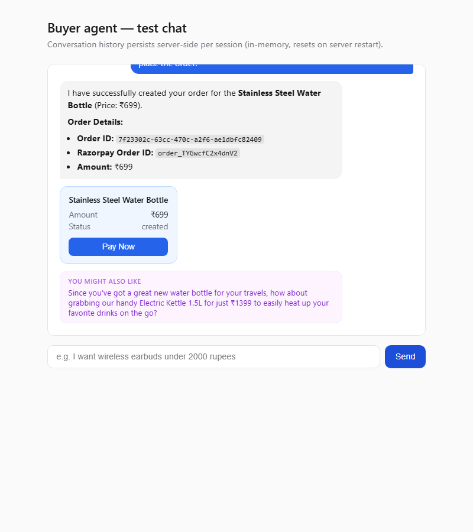
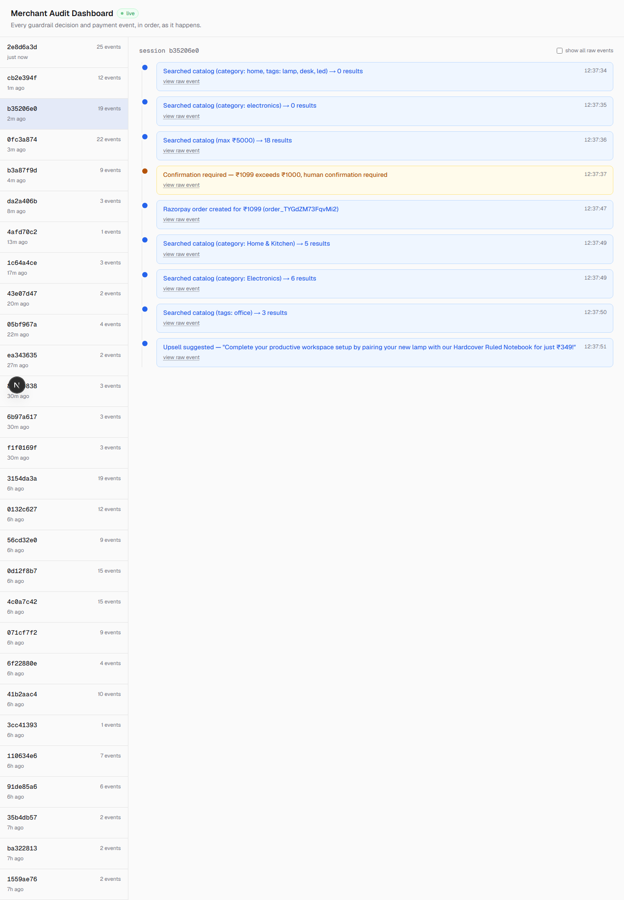
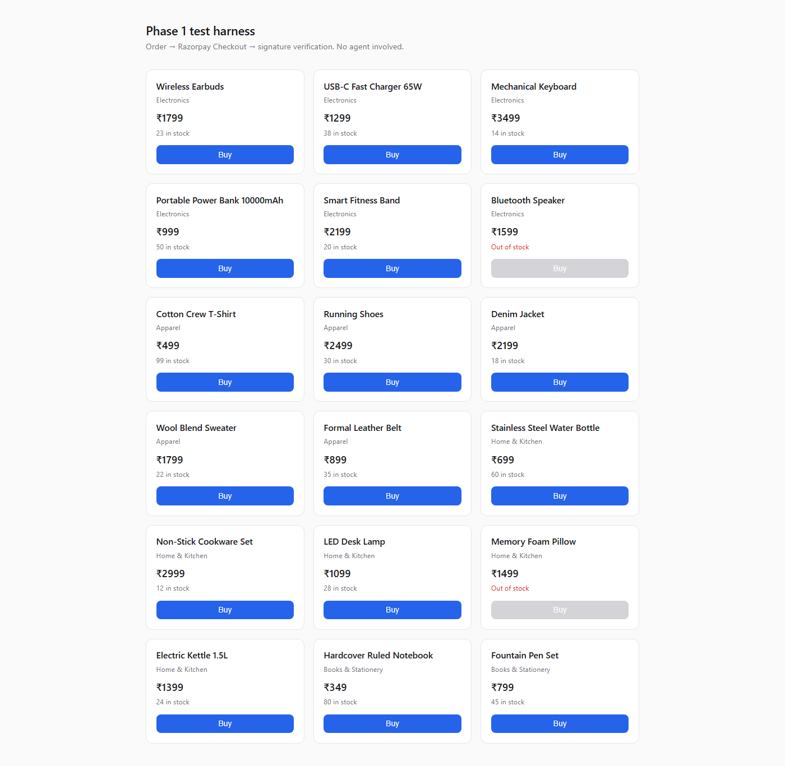

# PayPilot — Guardrailed AI Buyer Agent

**Track 1: AI Growth & Agentic Commerce.** A Razorpay test-mode merchant that's
fully transactable by an AI buyer agent, end to end — with visible guardrails,
a live audit trail, and graceful failure handling, not just a bot that talks
to its own store.

## Screenshots

*Everything below is a real run against the live system — real Gemini tool
calls, a real Razorpay test-mode order, real audit log entries — not mockups.*

**Buyer agent chat** — a purchase inside the guardrails, with the upsell
stretch agent's suggestion below it:



**Merchant audit dashboard** — the same conversation's full timeline: catalog
search (self-correcting across two attempts), the confirmation gate, the
order, and the upsell suggestion, each in plain language:



**Catalog / order test harness** (no agent involved) — the Phase-1 flow this
was built on top of, `search_catalog` → order → real Razorpay Checkout:



## What this is

An AI agent (Gemini, via function calling) can browse a real product catalog,
check a proposed purchase against merchant-configured guardrails, and place a
real Razorpay test-mode order — while every decision it makes is logged to an
audit trail a human can read in plain language, live, as it happens.

- **A hard spend cap** and a **confirmation threshold** for gray-zone
  purchases — the agent pauses and asks a human before crossing it.
- **A rule-based category block** and a **daily spend cap**, to bound
  runaway agent behavior.
- **Real payment-decline and out-of-stock recovery** — proven against actual
  Razorpay test-mode declines, not a hardcoded "pretend this failed" branch,
  including a genuine out-of-stock race (stock dropping to zero between order
  creation and payment) that triggers an in-stock alternative suggestion.
- **The catalog is independently queryable** by anyone — plain REST
  (`/api/catalog`, see [`backend/catalog-schema.md`](backend/catalog-schema.md))
  and a standalone [MCP server](backend/mcp_server/README.md), so any
  MCP-compatible agent, not just this project's own buyer agent, can transact
  with this merchant.
- **Stretch:** a second, smaller Gemini call suggests one complementary
  upsell item right after a successful purchase.

## Architecture

| Layer | Choice |
|---|---|
| Backend | Python 3.12 + FastAPI |
| Agent LLM | Google Gemini (`gemini-3.5-flash-lite`, free tier), via `google-genai`, function calling |
| Payments | Razorpay test-mode: Orders API, Checkout, Webhooks |
| DB | SQLite |
| Frontend | Next.js 16 + Tailwind v4 — merchant audit dashboard |
| MCP | Official Python MCP SDK, isolated in its own venv (see below) |

```
backend/
  app/            FastAPI app: catalog, orders, webhooks, the Gemini agent,
                   guardrails, audit log, failure handling, upsell
  static/         Minimal test harnesses (checkout flow, buyer-agent chat)
  mcp_server/      Standalone MCP catalog server, its own venv
  catalog-schema.md
frontend/         Next.js merchant audit dashboard (live timeline)
docs/             Original implementation plan and build-agent instructions
```

## Running it

**Backend:**
```bash
cd backend
python -m venv venv
./venv/Scripts/pip install -r requirements.txt   # venv/bin/pip on macOS/Linux
cp ../env.backend.example .env                    # fill in real values
./venv/Scripts/python -m app.seed                 # seed catalog + guardrail config
./venv/Scripts/python -m uvicorn app.main:app --host 127.0.0.1 --port 8000
```

Open `http://127.0.0.1:8000/test/agent-chat.html` (buyer-agent chat) or
`http://127.0.0.1:8000/test/checkout.html` (plain order→payment, no agent).

**Frontend (merchant audit dashboard):**
```bash
cd frontend
npm install
cp ../env.frontend.local.example .env.local
npm run dev
```
Open `http://localhost:3000`.

**Razorpay webhooks:** need a public HTTPS tunnel to `localhost:8000`
(ngrok or Cloudflare's `cloudflared`) — point a Razorpay Dashboard webhook at
`<tunnel-url>/api/webhooks/razorpay`, subscribed to `payment.captured`,
`payment.failed`, `order.paid`.

**MCP catalog server** (optional stretch, isolated dependencies —
see [`backend/mcp_server/README.md`](backend/mcp_server/README.md)):
```bash
cd backend/mcp_server
python -m venv venv
./venv/Scripts/pip install -r requirements.txt
./venv/Scripts/python test_client.py    # proves it works, using the MCP SDK's own client
```

**Resetting to a clean demo state** (clears test orders/audit history,
restores stock, leaves guardrail config untouched):
```bash
cd backend && ./venv/Scripts/python -m app.reset_demo
```

## Unit convention

Every `*_inr` value — database, agent tool inputs/outputs, audit log — is
**whole rupees**. The only ×100 rupees→paise conversion in the entire
codebase happens in `create_razorpay_order()`
(`backend/app/razorpay_client.py`), immediately before the Razorpay API call.
